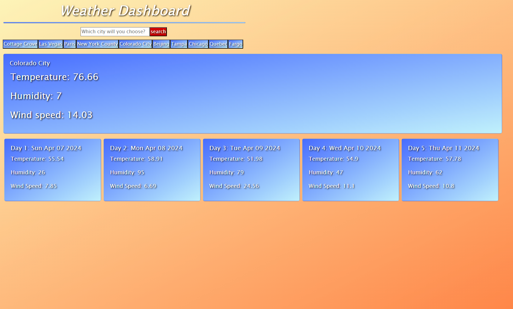

# Weather-Dashboard

## Description
This is a repository for Challenge 6 in the Bootcamp Coding Course. It is a 5 day weather forecast of any city of your choice.

## Table of Contents
- [Installation](#installation)
- [Usage](#usage)
- [Contributing](#contributing)
- [Tests](#tests)
- [Credits](#credits)
- [License](#license)

## Installation
None

## Usage
Anyone can use

## Contributing
Anyone can contribute

## Tests
None

## Credits
https://coding-boot-camp.github.io/full-stack/apis/how-to-use-api-keys
https://openweathermap.org/forecast5
https://day.js.org/docs/en/display/format
https://developer.mozilla.org/en-US/docs/Web/API/Fetch_API/Using_Fetch
https://www.w3schools.com/css/css3_gradients.asp

## License
None

## Screenshot
